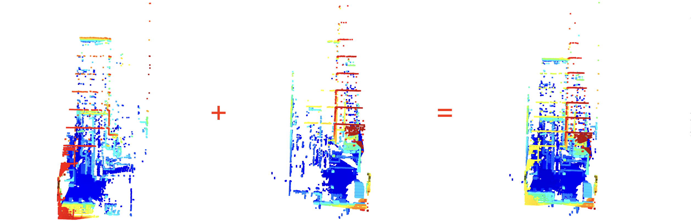

# Convert pcap to ply and merge ply files from different sensors
Currently, the command from the ouster documentation that converts pcap to ply works for data from one sensor only: 

 `$ python3 -m ouster.sdk.examples.pcap $SAMPLE_PCAP $SAMPLE_JSON pcap-to-ply --scan-num $SCAN_NUM`

 This repo automates the conversion of pcap files with more than one json config file and merges the output ply files to prepare for point cloud labeling with [labelCloud](https://github.com/ch-sa/labelCloud). 



## Requirements
1. Install requirements (compatible with labelCloud)

    `$ pip install -r requirements.txt`

2. Get extrinsics from ouster API
    ```
    import requests
    from requests.auth import HTTPBasicAuth

    user = your_username
    password = your_password
    sensor_ip = your_sensor_ip
    
    auth = HTTPBasicAuth(user, password)
    requests.get(f"https://{sensor_ip}/perception/api/v1/swagger/ui#/Registration/getExtrinsics", verify=False, auth=auth)
    ```
    Example response: 
    ```
    {
      "destination_frame": "world",
      "p_x": 43.73017883300781,
      "p_y": -2.257012367248535,
      "p_z": 7.608055591583252,
      "q_w": 0.2536286413669586,
      "q_x": 0.019166436046361923,
      "q_y": 0.9670660495758057,
      "q_z": 0.009399726055562496,
      "source_frame": "122216001766"
    }
    ```
    Edit transformations in [merge_ply_files.py](merge_ply_files.py) given p and q: 
    ```
    # add corresponding points and quaternions per sensor
    transformations = [
        {'sensor': "122216001766", 
            'q': (0.2536286413669586, 0.019166436046361923, 0.9670660495758057, 0.009399726055562496), 
            'p': (43.73017883300781, -2.257012367248535, 7.608055591583252)},
        {'sensor': "122222002441", 
            'q': (-0.021351803094148636, 0.9635326266288757, -0.005909430328756571, -0.2666722238063812), 
            'p': (-0.5344054698944092, -0.015509381890296936, 6.518174171447754)}
    ]
    ```

### File Structure
The following file structure is assumed:
```
pcaps/: path to all pcap recordings
|--- pcap_prefix/: this folder contains 1 pcap file and i json configuration files 
|    |--- pcap_prefix_sensor_id_i.json: configuration file for each lidar sensor
|    |--- pcap_prefix.pcap: pcap recording 
|--- (...)
```
## Run

1.  `$ python3 pcap_to_ply.py --scan_num N --path /path/to/pcaps`

    This command:
    - Creates a subdirectory for each sensor 
    - Calls the ouster command to convert pcap to ply given the number of scans (from 0 to N, change N accordingly)
    - Moves the generated ply files to each sensor subdirectory


2. `$ python merge_ply_files.py --sample N --path /path/to/pcaps --out /path/to/output --visualize True`
   
    This command:
    - Loads random ply files with same frame number from different sensors
    - Transforms point clouds: gets rotation matrix from quaternions and translates position (get from ouster extrinsics - see [Requirements](#requirements))
    - Merges point clouds and saves to output path (`"./merged_clouds/"` by default)
    - Visualizes the merged point cloud if set to True

3. Load point clouds in 3d point cloud labeling tool (labelCloud)
